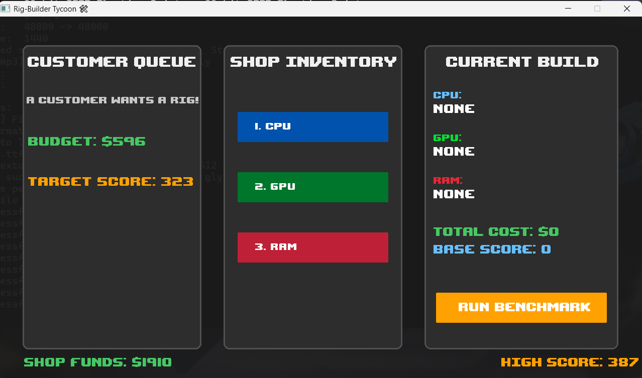
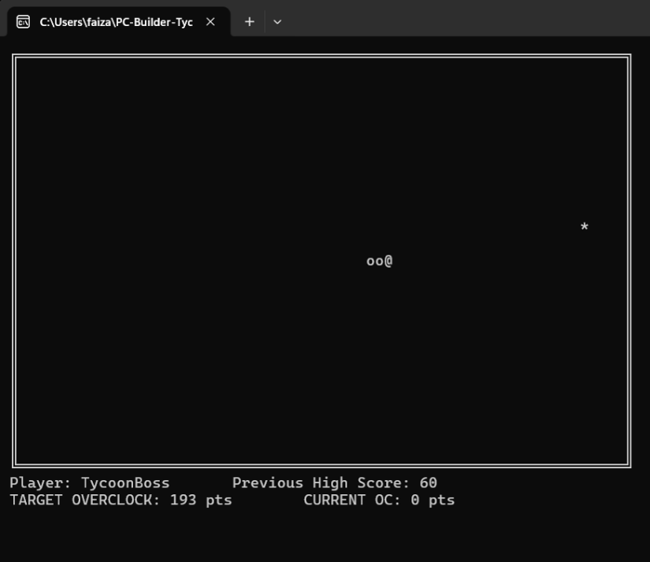
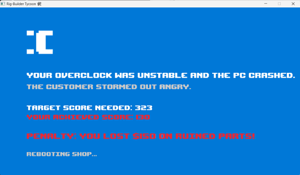

# RigBuilder Tycoon 🖥️🛠️

**Build Rigs. Crush Benchmarks. Become a Tycoon.**

RigBuilder Tycoon is an interactive PC building simulation that strictly adheres to Object-Oriented Programming (OOP) principles. Moving beyond standard console applications, this project features a fully graphical shop interface where players take customer orders, assemble PCs under strict budgets, navigate hardware bottlenecks, and overclock their builds by completing a bridged C-based Snake mini-game.

## 🎓 Educational Purpose [Why we made this]
**This game was built specifically for non-tech-savvy individuals.** For players who do not know much about computer hardware, this game serves as an interactive learning tool. By playing, users organically learn about:
* **Component Relationships:** How CPUs, GPUs, and RAM interact to dictate total system performance.
* **Hardware Compatibility:** The specific requirements of modern components (e.g., learning that a new Intel Core Ultra 9 requires DDR5 RAM, and cannot be slotted into an old DDR3 motherboard).
* **System Bottlenecks:** The reality of unbalanced PC builds. Players quickly learn that pairing a $900 RTX 5090 GPU with a weak, decade-old Intel i3 CPU will result in massive performance bottlenecks, effectively ruining their investment.

---

## 🧠 Core Architecture & OOP Principles

This game was engineered from the ground up to demonstrate the practical application of core C++ OOP concepts, manual memory management, and File I/O, entirely bypassing standard template libraries (STL).

* **Inheritance & Polymorphism:** Hardware naturally falls into a hierarchical class structure. A base abstract `Component` class provides the blueprint, while specific parts (`CPU`, `GPU`, `RAM`) inherit from it to calculate their own unique performance metrics.
* **Abstraction & Pure Virtual Functions:** The base `Component` class acts as an **Abstract Class** by utilizing a pure virtual function (`virtual int calculatePerformance() = 0;`). This enforces strict architectural rules: a generic "component" cannot be instantiated. Instead, child classes must provide their own specific logic. For example, the `CPU` class overrides this function to return `basePerformance * 2`, while the GPU and RAM classes use their own unique mathematical formulas to calculate their output.
* **Composition:** The master `PC` class does not inherit from components; it *has* components, utilizing an array of pointers to dynamically iterate through parts and calculate total system costs and base scores.
* **Custom Memory Management:** The project deliberately bypasses `<vector>`, utilizing a custom, memory-safe Template `Array<T>` class to handle inventory pointers. At the end of the game loop, a dedicated cleanup phase safely `delete`s all dynamically allocated heap memory, ensuring zero memory leaks.
* **Data Persistence:** An independent File I/O class (`SaveSystemPlus`) tracks shop funds and high scores across multiple sessions. It auto-saves immediately after every transaction, ensuring player progress is safe even in the event of an unexpected crash.

---

## 🔗 The Snake Engine Bridge (Inter-Program Communication)

One of the most complex engineering feats of this project is how the C++ GUI communicates with an independent C-based console game. Since the two programs run in completely separate memory spaces, we engineered a robust bridge using File I/O:

1. **The Handshake:** When the user clicks Benchmark, `main.cpp` calculates the required overclock points and writes them to a temporary file (`snake_target.txt`). 
2. **The Wipe:** To prevent "phantom points," the C++ engine actively wipes the `snake_bonus.txt` file with a `0` before launch, ensuring leftover data from previous crashes cannot cheat the game.
3. **The Suspension:** The main game loop halts itself using `system("start /wait Snake_Renewed.exe")`, launching the C console game on top of the GUI.
4. **The Execution:** `Snake_Renewed.exe` reads the target file to display live UI requirements to the player. Upon game over, it writes the total apples eaten to `snake_bonus.txt` and closes.
5. **The Return:** The C++ engine resumes, captures the delta-time spike (capping it to 60FPS to prevent animation breaks), reads the bonus file, and calculates the final PC performance score.

---

## 🎮 Features & Mechanics

* **Dynamic Economy:** Randomized customer budgets scale with the price of high-end parts (ranging from $500 to $1600).
* **The Overclock Bonus:** Simply meeting the target score is enough to pass, but exceeding the target benchmark score grants the player a scaled multiplier of extra "Overclock Bonus" cash.
* **Polymorphic Benchmarking:** Because each piece of hardware scales differently, the system utilizes runtime polymorphism. When the player clicks "Benchmark," the master `PC` object loops through its inventory array and dynamically triggers the correct, unique `calculatePerformance()` math for the CPU, GPU, and RAM, automatically fusing them together into the final Base Score.
* **Strict Hardware Rules:** The game actively blocks incompatible hardware combinations. Custom UI popups will flash red, warning the user if they mix generations (e.g., DDR3 with DDR5) or if they forget to select all three components before benching.
* **Bottleneck Penalties:** Combining bleeding-edge technology with a low-tier processor results in a massive 150-point mathematical penalty to the base score.
* **Penalty States (BSOD):** Going over budget or failing an overclock triggers a timed, full-screen "Blue Screen of Death" (BSOD) penalty. The angry customer storms out, and the player permanently loses the money they invested in the ruined parts.

---

## 📸 Screenshots


> **The Shop Interface:** Manage customer budgets, assemble parts, and calculate your Base Score.


> **The Benchmark:** An integrated Snake game that reads the required Overclock points live.


> **The BSOD Penalty:** Triggered by unstable builds, bottlenecks, or going over budget, causing the player to lose their invested hardware funds.

---

## ⚙️ Prerequisites & Dependencies

To compile and run this project, you will need the following tools installed on your system:

1. **C++ Compiler:** MinGW-w64 (GCC) is recommended for Windows.
2. **CMake:** Version 3.10 or higher.
3. **Visual Studio Code (VS Code):** With the following extensions installed:
   * `C/C++` (by Microsoft)
   * `CMake Tools` (by Microsoft)
4. **Raylib:** The project utilizes the Raylib graphics library (which should be configured within your `CMakeLists.txt` file).

---

## 🚀 Installation & Setup

Follow these steps to download, compile, and run the game:

### 1. Download the Game
1. Click the green **`<> Code`** button at the top of this repository.
2. Select **`Download ZIP`**.
3. Extract the downloaded ZIP file to a folder on your computer.

### 2. Compile the Project
1. Open the extracted folder in **Visual Studio Code**.
2. Ensure you have the CMake Tools extension installed.
3. A prompt may appear at the bottom asking you to select a "Kit" (Compiler). Select your installed **GCC/MinGW** compiler.
4. Open the terminal in VS Code (`Terminal -> New Terminal`).
5. If you have a `build.bat` script included, simply run:
   ```bash
   ./build.bat
   ```
   *Alternatively, you can compile manually using CMake:*
   ```bash
   mkdir build
   cd build
   cmake ..
   cmake --build .
   ```
   
### 3. Run the Game
Once compiled successfully, navigate to your output directory (usually the `build` or `bin` folder) and double-click the **`RigBuilderTycoon.exe`** file!

---

## 🕹️ How to Play
1. **Wait for a Customer:** A customer will appear with a randomized Budget and a Target Score.
2. **Build the Rig:** Select a CPU, GPU, and RAM from the Shop Inventory. Keep an eye on your Total Cost and Base Score.
3. **Check the Bottleneck:** Make sure your parts are compatible! If you fall short of the Target Score, the "OC Needed" indicator will tell you exactly how many points you need to grind.
4. **Run Benchmark:** Click Benchmark to open the Snake Overclocking mini-game. Eat apples to increase your score. Every apple gives you 2 performance points.
5. **Profit:** Meet the target score without going over budget to earn your base profit plus an Overclock Bonus!

---

## 🛠️ Modifying & Recompiling
If you want to edit the game logic (for example, adding new components to the arrays in `main.cpp` or tweaking the economy logic):

1. Open the necessary `.cpp` or `.h` files in VS Code and make your changes.
2. Save the files.
3. You **must recompile** the game for the changes to take effect.
4. Simply run the `build.bat` script again, or use the CMake build command:
   ```bash
   cmake --build build
   ```
5. Launch the updated `.exe` to test your changes!

---
*Developed by Faizan Talha, Muhammad Ali, and Muhammad Zain Salar.*
